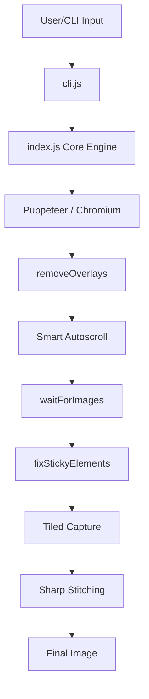

# 📸 Webshot

A lightning-fast, production-ready batch screenshot tool built with Node.js, Puppeteer, and Sharp. Designed for high-performance web archiving and automated testing.

[](https://www.npmjs.com/package/@puralex/webshot)
[](https://opensource.org/licenses/ISC)

---

## 🚀 Quick Start (No Install)

Run Webshot immediately without local installation using `npx`:

```bash
npx @puralex/webshot https://acme.com
```

---

## 🚀 Features

- **⚡ Parallel Processing**: Concurrently processes URLs in batches of 5, dramatically reducing capture time for large lists.
- **🔗 Unicode Filenames**: Advanced naming logic that correctly decodes percent-encoded URLs and preserves non-Latin (Cyrillic, etc.) characters in filenames.
- **🏗️ Full-Page Stitching**: Intelligently captures extremely tall pages (up to 16,384px) by tiling and stitching captures with Sharp to avoid GPU memory limits.
- **🛡️ Smart Overlay Removal**: Automatically identifies and hides cookie banners, GDPR consents, and popups to ensure a clean capture.
- **📌 Sticky Header Handling**: Fixes `position: fixed` and `sticky` headers so they appear only once at the top of the image instead of repeating across tiles.
- **📜 Enhanced Lazy Loading**: Deliberate autoscroll logic and `waitForImages` utility ensure all lazy-loaded assets are fully rendered before capture.
- **📱 Responsive Breakpoints**: Built-in support for standard Tailwind/Bootstrap breakpoints or custom pixel-perfect widths.

---

Install globally to use the `magnifito-webshot` command anywhere:

```bash
npm install -g @puralex/webshot
# or
pnpm add -g @puralex/webshot
```

> [!NOTE]
> The command is named `magnifito-webshot` to avoid collisions with the legacy `webshot-cli` package.

---

## 🛠️ Usage

### CLI Examples

Once installed, use the `magnifito-webshot` command:

```bash
# Basic capture
magnifito-webshot https://acme.com

# Batch capture from file (processed in parallel batches of 5)
magnifito-webshot -f urls.txt

# Specify custom output directory and responsive breakpoint
magnifito-webshot https://acme.com -o ./dist -b lg

# Use custom pixel width (overrides breakpoints)
magnifito-webshot https://acme.com -w 1440
```

#### CLI Options Reference

| Option | Shorthand | Description | Default |
| :--- | :--- | :--- | :--- |
| `--file` | `-f` | Path to a text file with one URL per line | - |
| `--output` | `-o` | Target directory for saved images | `./screenshots` |
| `--breakpoint` | `-b` | `sm`, `md`, `lg`, `xl`, `2xl` | `1920px` |
| `--width` | `-w` | Custom width in pixels | - |
| `--format` | `-F` | Output format: `png`, `jpg`, `webp` | `png` |
| `--quality` | `-q` | Quality for `jpg`/`webp` (1-100) | - |
| `--delay` | `-d` | Wait time in ms after scrolling | `0` |
| `--no-scroll` | - | Skip auto-scrolling | - |

---

## 🏗️ Architecture & Technical Details

Webshot uses a multi-stage capture pipeline to ensure high-fidelity results:



- **Smart Autoscroll**: Performs an incremental scroll-and-wait routine to trigger lazy-loaded assets.
- **Layout Stabilization**: Automatically hides modals/banners and converts sticky elements to absolute positioning to prevent duplication in full-page images.
- **Hybrid Capture**: Uses a single full-page capture for normal pages and a tiled stitching approach for "infinite scrollers" or very long articles.

---

## ❓ Troubleshooting

- **Puppeteer Dependency Errors**: If running on Linux, you may need to install specific system libraries (libnss3, libatk, etc.).
- **Memory Limits**: Extremely long pages might use significant RAM during stitching. If crashes occur, try reducing the `MAX_TEXTURE_HEIGHT` in `index.js`.
- **Navigation Timeout**: For slow websites, increased browser protocol timeouts are pre-configured to 2 minutes.


---

## 🛠️ Development

### Local Installation
```bash
git clone https://github.com/magnifito/webshot.git
cd webshot
npm install
```

### Running Tests
```bash
npm test
```

### Local Development (Auto-reload)
```bash
npm run dev
```

---

## 🤝 Contributing

1. Fork the repository.
2. Create your feature branch (`git checkout -b feature/AmazingFeature`).
3. Commit your changes (`git commit -m 'Add some AmazingFeature'`).
4. Push to the branch (`git push origin feature/AmazingFeature`).
5. Open a Pull Request.

---

## 📄 License

ISC © [Kiril Kirov](mailto:kiril@forkpoint.com)
