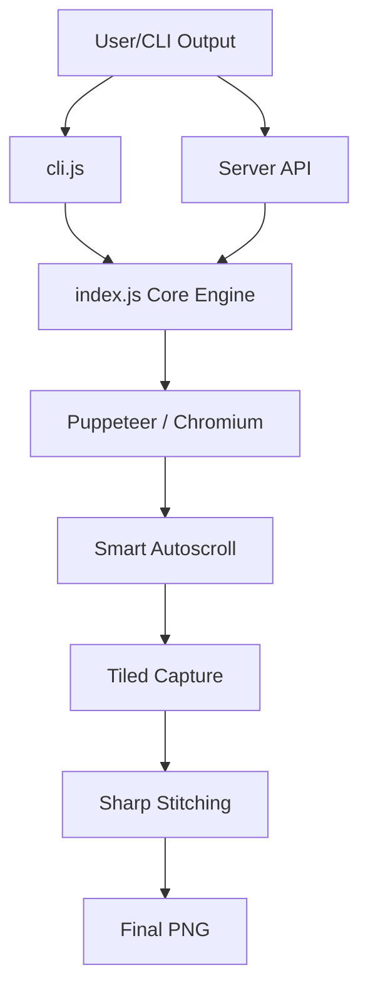

# 📸 Webshot

A lightning-fast, production-ready batch screenshot tool built with Node.js, Puppeteer, and Sharp. Designed for high-performance web archiving and automated testing.

[](https://www.npmjs.com/package/@puralex/webshot)
[](https://opensource.org/licenses/ISC)

---

## 🚀 Quick Start (No Install)

Run Webshot immediately without local installation using `npx`:

```bash
npx @puralex/webshot https://acme.com
```

---

## 🚀 Features

- **⚡ Parallel Processing**: Concurrently processes URLs in batches of 5, dramatically reducing capture time for large lists.
- **🔗 Unique Filenames**: Advanced naming logic based on full URL paths (e.g., `hostname_path_width.png`) to prevent collisions and overwrites.
- **🏗️ Full-Page Stitching**: Intelligently captures extremely tall pages (up to 16,384px) by tiling and stitching captures with Sharp to avoid GPU memory limits.
- **📜 Smart Autoscroll**: Simulates human behavior to trigger lazy-loaded images and dynamic content before capture.
- **📱 Responsive Breakpoints**: Built-in support for standard Tailwind/Bootstrap breakpoints or custom pixel-perfect widths.
- **🐳 Docker Native**: Ready-to-use Docker environment with pre-configured Chromium and dependencies.
- **🌐 Dual Mode**: Use it as a powerful CLI tool or a lightweight microservice via its Express API.

---

Install globally to use the `magnifito-webshot` command anywhere:

```bash
npm install -g @puralex/webshot
# or
pnpm add -g @puralex/webshot
```

> [!NOTE]
> The command is named `magnifito-webshot` to avoid collisions with the legacy `webshot-cli` package.

---

## 🛠️ Usage

### CLI Examples

Once installed, use the `magnifito-webshot` command:

```bash
# Basic capture
magnifito-webshot https://acme.com

# Batch capture from file (processed in parallel batches of 5)
magnifito-webshot -f urls.txt

# Specify custom output directory and responsive breakpoint
magnifito-webshot https://acme.com -o ./dist -b lg

# Use custom pixel width (overrides breakpoints)
magnifito-webshot https://acme.com -w 1440
```

#### CLI Options Reference

| Option | Shorthand | Description | Default |
| :--- | :--- | :--- | :--- |
| `--file` | `-f` | Path to a text file with one URL per line | - |
| `--output` | `-o` | Target directory for saved images | `./screenshots` |
| `--breakpoint` | `-b` | `sm`, `md`, `lg`, `xl`, `2xl` | `1920px` |
| `--width` | `-w` | Custom width in pixels | - |
| `--serve` | - | Starts the tool in HTTP Server Mode | - |
| `--port` | `-p` | Specific port for Server Mode | `3011` |

---

### 🌐 Server Mode (API)

Run Webshot as a background microservice:

```bash
magnifito-webshot --serve -p 3011
```

#### API Endpoint: `GET /screenshot`

| Parameter | Type | Required | Description |
| :--- | :--- | :--- | :--- |
| `url` | String | Yes | The target URL to capture |
| `breakpoint` | String | No | Target breakpoint name |

**Success Response (JSON):**
```json
{
  "image": "data:image/png;base64,iVBORw0KGgoAAAANSUh..."
}
```

---

## 🐳 Docker Integration

Docker provides the most stable environment for Puppeteer, especially on CI/CD pipelines.

### Docker Compose
```bash
docker-compose up -d --build
```

### Direct CLI via Docker
```bash
docker-compose run puppeteer-in-docker node cli.js https://acme.com
```

---

## 🏗️ Architecture & Technical Details

Webshot is split into two primary layers:



- **Smart Autoscroll**: To handle modern web apps, the core engine performs an incremental scroll-and-wait routine, ensuring all lazy-loaded assets are rendered.
- **Hybrid Capture**: For pages within the Chromium viewport limit, a single full-page capture is taken. For "infinite scrollers" or very long articles, the system captures tiles and merges them into a single high-resolution PNG using Sharp.

---

## ❓ Troubleshooting

- **Puppeteer Dependency Errors**: If running locally on Linux, you may need to install specific system libraries (libnss3, libatk, etc.). Using **Docker** is the recommended fix.
- **Memory Limits**: Extremely long pages might use significant RAM during stitching. If crashes occur, try reducing the `MAX_TEXTURE_HEIGHT` in `index.js`.
- **Navigation Timeout**: For slow websites, you can increase the `timeout` setting in the `takeScreenshot` function within `index.js`.

---

## 🛠️ Development

### Local Installation
```bash
git clone https://github.com/magnifito/webshot.git
cd webshot
npm install
```

### Running Tests
```bash
npm test
```

### Local Development (Auto-reload)
```bash
npm run dev
```

---

## 🤝 Contributing

1. Fork the repository.
2. Create your feature branch (`git checkout -b feature/AmazingFeature`).
3. Commit your changes (`git commit -m 'Add some AmazingFeature'`).
4. Push to the branch (`git push origin feature/AmazingFeature`).
5. Open a Pull Request.

---

## 📄 License

ISC © [Kiril Kirov](mailto:kiril@forkpoint.com)
